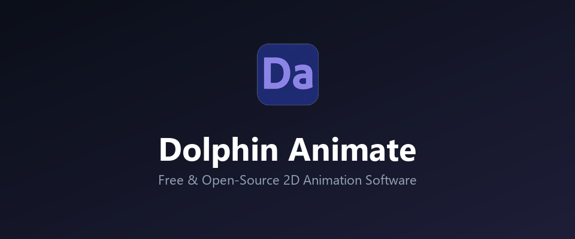
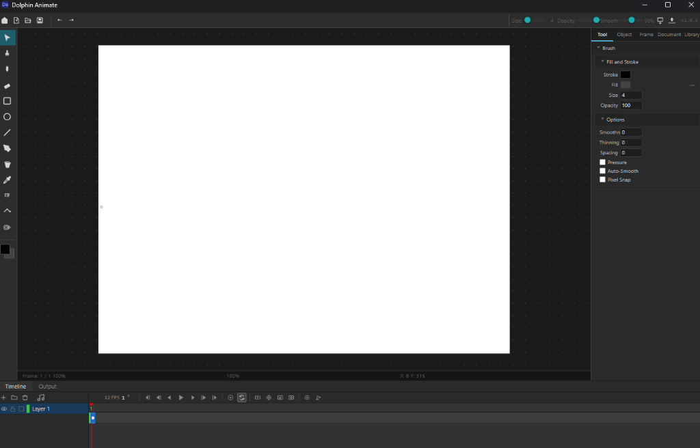

<p align="center">
  
</p>

<h3 align="center">Dolphin Animate</h3>

<p align="center">
  <strong>A lightweight, free, and open-source 2D frame-by-frame animation software designed for animators, designers, and game developers. Built with Electron and HTML5 Canvas.</strong>
</p>

<p align="center">
  <a href="https://agony2703.itch.io/dolphin-animate">
    
  </a>
</p>

<p align="center">
  
  
  
  
</p>

---

Dolphin Animate replicates the classic, intuitive timeline workflow of Macromedia Flash & Adobe Animate without the heavy subscription fee or bloatware.

---

## ✨ Key Features

<p align="center">
  
</p>

*   **🎬 Classic Flash-Style Timeline:** 
    *   **Frame Spanning (Exposure):** Normal frames share vector data with their parent keyframe, preventing file bloat and redundant memory allocation.
    *   **Standard Keybindings:** Toggle keyframes with `F7` (Insert Blank Keyframe), copy drawing with `F6`, and extend exposures easily using `F5`.
*   **✍️ Advanced Vector Brush & Pencil:**
    *   **Smooth Variable-Width Strokes:** Real pressure sensitivity (Wacom/drawing tablet) or mouse-speed pressure simulation via the `perfect-freehand` library.
    *   **Auto-Smooth:** Dynamically simplifies rough freehand drawings into clean Catmull-Rom Bezier curves.
    *   **Thinning & Spacing controls:** Prevent negative/out-of-bounds inputs, and enjoy zoom-corrected drawing consistency at any zoom level.
*   **🔄 Free Transform Overhaul:**
    *   Scale, rotate, skew, and move selected vector strokes or groups.
    *   Set custom pivot points (anchor points) to define rotation and scale centers.
*   **🛠️ Complete Toolset:**
    *   **Fill Tool:** High-quality flood fill with gap closing and anti-aliasing.
    *   **Eraser Tool:** Intelligently splits and cuts vector lines.
    *   **Shape primitives:** Rectangles, Circles, and straight Lines.
    *   **Motion Guide:** Path-based guides for movement.
*   **📦 Game Dev Export Options:**
    *   Export as a **Sprite Sheet** (with full JSON metadata, perfect for Unity, Godot, Unreal, or web engines).
    *   Export as **animated GIFs**, **PNG sequences**, or **MP4 videos**.

---

## 🚀 Quick Start

To run the application locally in development mode:

1. Clone the repository and navigate into it:
   ```bash
   git clone https://github.com/Agony270313/Dolphin-Animate.git
   cd Dolphin-Animate
   ```
2. Install the dependencies:
   ```bash
   npm install
   ```
3. Run the development server:
   ```bash
   npm run start
   ```

To package/build the production installer executable (`.exe`):
```bash
npm run build
```

---

## ⌨️ Keyboard Shortcuts

| Shortcut | Action |
|---|---|
| **V** | Selection & Transform tool |
| **B** | Brush |
| **P** | Pencil |
| **E** | Eraser |
| **G** | Fill (Paint Bucket) |
| **R** | Rectangle |
| **O** | Oval (Circle) |
| **L** | Line |
| **T** | Text |
| **A** | Pen (Vector Anchor Path) |
| **M** | Motion Guide line |
| **F5** | Extend exposure / Insert frame |
| **F7** | Insert blank keyframe |
| **F6** | Insert duplicate keyframe |
| **Delete** | Delete selected object(s) |
| **Ctrl + Z** | Undo |
| **Ctrl + Y** | Redo |
| **Space / Enter** | Play / Pause playback |
| **Arrow Keys** | Move selected object 1px (Hold Shift for 10px) |

---

## ⚙️ Tech Stack

*   **Electron:** Desktop framework.
*   **Vite:** Ultra-fast bundling and assets hot-reloading.
*   **HTML5 Canvas:** Low-level, high-performance rendering.
*   **Pure TypeScript/JavaScript:** Minimal external dependencies for longevity and execution speed.

---

## 📄 License

This project is licensed under the MIT License - see the [LICENSE](LICENSE) file for details. Free to use, modify, and distribute for personal or commercial projects.

---

## ⚖️ Disclaimer

Adobe Animate, Macromedia Flash, and related trademarks are the property of Adobe Inc. Dolphin Animate is an independent open-source project and is not affiliated with, endorsed by, or sponsored by Adobe Inc. or any other trademark holder.

